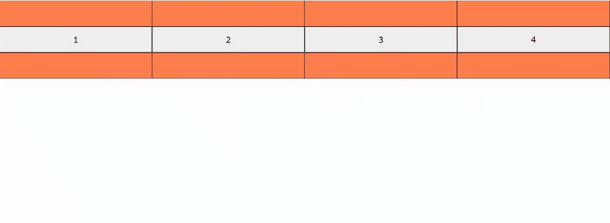

# With Javascript Change Color

<h3>visit: https://aokmen.github.io/first_javascript</h3>

# Description:
---
* This code defines a simple HTML page that contains three rows of four colored boxes, each with a button. When a button is clicked, the corresponding box changes its background color, and a text label is added to the box below it, displaying the color value that was selected.
---
* The CSS styles define the appearance of the boxes, buttons, and text labels. The boxes are displayed using flexbox, and each box has a black border and a coral background color by default. The buttons take up the full width and height of their respective boxes and have a font size of 2em.
---
* The JavaScript functions handle the box color changes and text label creation. Each function selects the corresponding box element, changes its background color using the style property, and creates a new text label using the createElement method. The text label's innerText property is set to the selected color value, and the label is appended to the box below it using the appendChild method.
